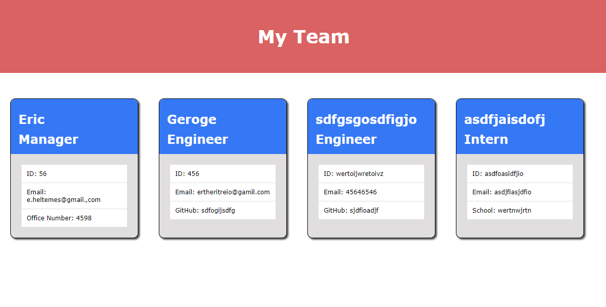

# team_profile_generator

## Discription
* builds html from the command prompt

## Usage
* open in node and answer prompts. 
* after the prompt for manager, the main menu will loop with engineers and interns until the user chooses to build HTML

## Testing
* tested classes using jest

## 

[VideoLink](https://drive.google.com/file/d/14dkDw1cAxr4X6nwdmDoBS7LfUCfq1VAh/view?usp=sharing)

SITE LINK: https://erheltemes.github.io/team_profile_generator/
